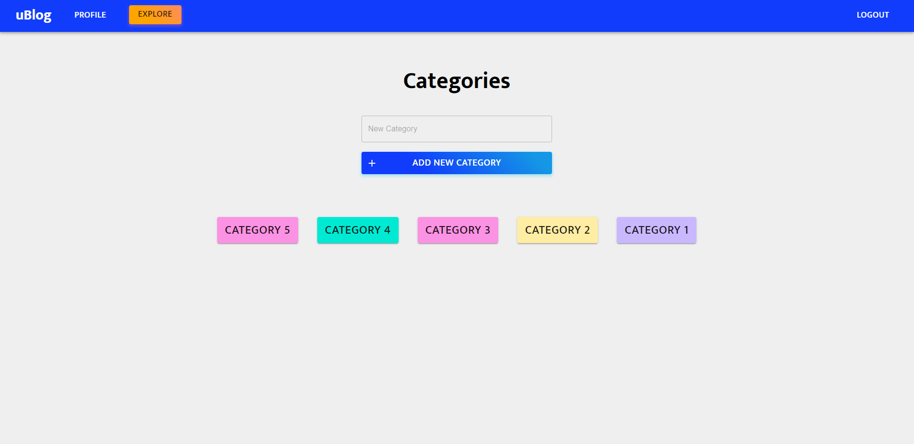

This project is currently in development and has not been hosted. Due to this reason, any links for this project will be redirected to the github repo. This application is being built with the MERN stack (React, Express, Node.js, MongoDB).

I have provided some images below to show my progress. Some currently implemented features include creating an account, login/logout, creating a category, and creating a post. 

